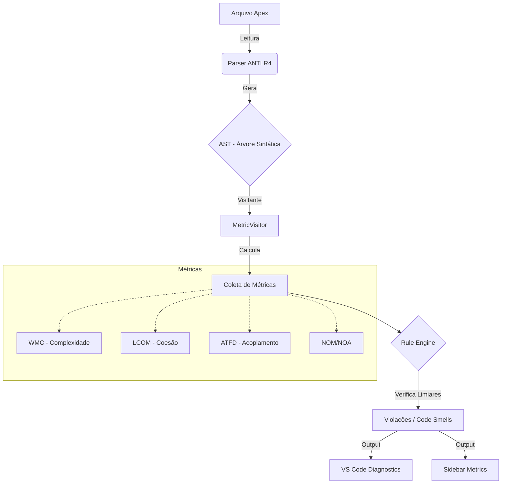
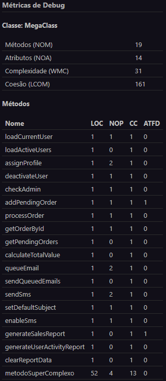
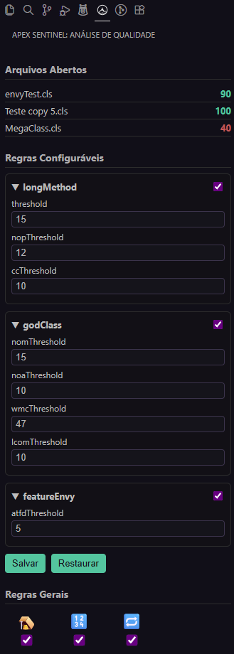

# Apex Sentinel

**Apex Sentinel** é uma extensão para o Visual Studio Code focada na análise estática de código Apex. O objetivo da ferramenta é identificar *Code Smells* em tempo real, fornecendo métricas de qualidade como Complexidade Ciclomática,
Coesãoe Acoplamento, ajudando desenvolvedores a manterem seus projetos limpos e manuteníveis.

## Participantes

| Alunos integrantes | Professores responsáveis |
| --- | --- |
| Pedro Lucas Aires dos Santos | João Paulo Aramuni (Prof. orientador) |
| - | Cleiton Silva Tavares |
| - | Joana Gabriela Ribeiro de Souza |
| - | Leonardo Vilela Cardoso |


## Funcionalidades

* **Análise em Tempo Real:** Detecta problemas assim que o arquivo é aberto ou editado.
* **Métricas de Qualidade:** Calcula WMC, LCOM, ATFD, NOM e NOA.
* **Detecção de Code Smells:**
  * God Class
  * Feature Envy
  * Long Method
  * Empty Catch Block
  * Magic Numbers
  * Nested Loops
* **Sidebar Interativa:** Visualização gráfica das métricas e configuração de regras.
* **Quick Fixes:** Links diretos para documentação de refatoração.
* **Json de configuração:** Arquivo .apexsentinelrc.json criado na raiz do projeto com as configurações compartilhadas.

---

## Tecnologias Utilizadas

* **Language:** [TypeScript](https://www.typescriptlang.org/)
* **Framework:** [VS Code Extension API](https://code.visualstudio.com/api)
* **Parser:** [ANTLR4](https://www.antlr.org/) & [apex-parser](https://github.com/nawforce/apex-parser)
* **UI:** HTML/CSS/JS (Webview API)
* **Testes:** Mocha, Chai e C8

---

## Instalação e Execução (Ambiente de Desenvolvimento)

### Pré-requisitos

* Node.js (v16 ou superior)
* Visual Studio Code

### Passos

1. **Clone o repositório:**

    ```bash
    git clone [https://github.com/SeuUsuario/apex-sentinel.git](https://github.com/SeuUsuario/apex-sentinel.git)
    cd apex-sentinel
    ```

2. **Instale as dependências:**

    ```bash
    npm install
    ```

3. **Compile o projeto:**

    ```bash
    npm run compile
    # Ou para assistir mudanças em tempo real:
    npm run watch
    ```

4. **Execute a Extensão:**
    * Abra o projeto no VS Code.
    * Pressione `F5` para abrir uma nova janela (Extension Host) com a extensão carregada.

5. **Rodar Testes:**

    ```bash
    npm test
    ```

---

## Instalação e Execução (VSCode)

1. Entrar na aba de extensões do VisualStudio code ou no [marketplace](https://marketplace.visualstudio.com/VSCode)
2. Instalar a extensão no seu perfil/local
3. Abrir um arquivo Apex (.cls)

## Métricas e Análise

O Apex Sentinel utiliza a análise da Árvore de Sintaxe Abstrata, AST, para calcular métricas fundamentais de Engenharia de Software.

### Fluxo de Análise



### Definição das Métricas

As métricas são calculadas em tempo de execução para cada classe Apex:

| Métrica | Nome Completo | Descrição |
|--------|----------------|-----------|
| **WMC** | *Weighted Method Count* | Soma da Complexidade Ciclomática (CC) de todos os métodos da classe. Indica quão complexa e difícil de testar é a classe. |
| **CC** | *Cyclomatic Complexity* | Número de caminhos independentes dentro de um método (Base 1 + `if`, `for`, `while`, `catch`, etc.). |
| **LCOM** | *Lack of Cohesion of Methods* | Mede o quão pouco relacionados os métodos de uma classe estão. Calculado como (Q - P), onde **Q** é o número de pares de métodos que não compartilham atributos e **P** é o número de pares que compartilham. Quanto maior, pior a coesão. |
| **ATFD** | *Access to Foreign Data* | Quantidade de atributos de outras classes acessados pelos métodos. Indica acoplamento excessivo. |
| **NOM** | *Number of Methods* | Contagem total de métodos da classe. |
| **NOA** | *Number of Attributes* | Contagem total de atributos (variáveis de instância). |

---

## Code Smells Detectados

A extensão compara as métricas calculadas com os limiares configuráveis (`.apexsentinelrc.json` ou Sidebar).

### 1. **God Class (Classe Deus)**

Classes com baixa coesão e alta complexidade.

**Critério padrão:**
> ATFD > 5 AND WMC > 47 AND LCOM > 0

---

### 2. **Feature Envy (Inveja de Recurso)**

Método demonstra interesse excessivo nos dados de outra classe.

**Critério padrão:**
> ATFD > 5
---

### 3. **Long Method (Método Longo)**

Métodos muito longos, difíceis de ler e manter.

**Critério padrão:**
* Linhas de código > 20 **OU**
* Complexidade ciclomatica > 10 **OU**
* Número de parâmetros > 5

---

### 4. Outras Regras

* **Empty Catch Block:** blocos `catch` vazios que silenciam erros.  
* **Nested Loops:** loops aninhados com profundidade > 2.  
* **Magic Numbers:** números literais usados diretamente sem constante.

---

## Testes

Para garantir a confiabilidade das métricas calculadas e a estabilidade da extensão, o projeto utiliza uma suíte de testes.  
A stack de testes inclui:

* **Mocha** – Testes de integração com o VS Code  
* **Jest** – Validação lógica das métricas  
* **C8** – Relatórios de cobertura de código  

---

### Como Executar

Para rodar a suíte de testes e gerar o relatório de cobertura localmente:

> npm run test

ou, para gerar o relatório de cobertura:

> npm run coverage

### Fluxos Cobertos

### 🔹 Cálculo de Métricas

Validação matemática precisa para:
* **LCOM**
* **WMC**
* **ATFD**
* **NOM/NOA**

---

### 🔹 Motor de Regras (Rule Engine)

Testes específicos para cada Code Smell suportado:

* God Class  
* Feature Envy  
* Long Method  
* Empty Catch Block  
* Magic Numbers  
* Nested Loops  

---

### 🔹 Parsing e Visitors

* Navegação correta pela AST do Apex  
* Consistência dos visitantes responsáveis por métricas e regras  

---

### 🔹 Gerenciamento de Configuração

* Leitura de regras personalizadas via `.apexsentinelrc`  
* Aplicação dinâmica das configurações no motor de análise  

---

### 🔹 Interface de Usuário

* Testes dos **Code Actions**  
* Testes dos **Diagnostics Providers**

---

## Relatório de Cobertura via C8

Abaixo está o resumo da cobertura de código atual,com foco especial nas regras de negócio e cálculos.

| File                                | % Stmts | % Branch | % Funcs | % Lines | Uncovered Line #s                 |
|-------------------------------------|---------|----------|---------|---------|-----------------------------------|
| All files                           | 90.4    | 86.12    | 79.67   | 90.4    |                                   |
| scripts                             | 82.6    | 50       | 100     | 82.6    |                                   |
| ├─ copy-assets.js                   | 82.6    | 50       | 100     | 82.6    | 8-10,16                           |
| └─ copy-webview.js                  | 82.6    | 50       | 100     | 82.6    | 8-10,16                           |
| src                                 | 86.15   | 83.33    | 100     | 86.15   |                                   |
| ├─ extension.ts                     | 86.15   | 83.33    | 100     | 86.15   | 18-22,39,51,58-59                 |
| src/analysis                        | 93.61   | 80       | 66.66   | 93.61   |                                   |
| ├─ codeSmellAnalyzer.ts             | 93.61   | 80       | 66.66   | 93.61   | 24-25,46                          |
| src/analysis/config                 | 95.54   | 95.45    | 72.72   | 95.54   |                                   |
| ├─ configurationManager.ts          | 95.54   | 95.45    | 72.72   | 95.54   | 12-13,15-16,143-145               |
| src/analysis/metrics                | 88.88   | 90.56    | 70      | 88.88   |                                   |
| ├─ atfdCalculatorVisitor.ts         | 87.71   | 80       | 75      | 87.71   | 21-22,30-34                       |
| ├─ attributeCollectorVisitor.ts     | 95.45   | 71.42    | 75      | 95.45   | 30-31                             |
| ├─ attributeUsageVisitor.ts         | 80.82   | 92.3     | 71.42   | 80.82   | 37-39,54-64                       |
| ├─ cyclomaticComplexityCalculator.ts| 88.63   | 100      | 64.28   | 88.63   | 55-56,63-64,67-68,71-72,75-76     |
| └─ lcomCalculator.ts                | 100     | 100      | 100     | 100     |                                   |
| src/analysis/rules                  | 97.25   | 93.58    | 86.66   | 97.25   |                                   |
| ├─ emptyCatchBlockRule.ts           | 96.29   | 90       | 83.33   | 96.29   | 39-40                             |
| ├─ featureEnvyRule.ts               | 100     | 83.33    | 100     | 100     | 10                                |
| ├─ godClassRule.ts                  | 100     | 100      | 100     | 100     |                                   |
| ├─ longMethodRule.ts                | 100     | 100      | 100     | 100     |                                   |
| ├─ magicNumberRule.ts               | 95.06   | 88.23    | 85.71   | 95.06   | 39-40,66-67                       |
| ├─ nestedLoopsRule.ts               | 95.55   | 93.75    | 80      | 95.55   | 37-40                             |
| └─ ruleFactory.ts                   | 100     | 100      | 100     | 100     |                                   |
| src/parsing                         | 93.33   | 50       | 100     | 93.33   |                                   |
| └─ parseAdapter.ts                  | 93.33   | 50       | 100     | 93.33   | 27-28                             |
| src/parsing/visitors                | 98.8    | 75       | 85.71   | 98.8    |                                   |
| └─ metricsVisitor.ts                | 98.8    | 75       | 85.71   | 98.8    | 109-110                           |
| src/test                            | 84.21   | 50       | 100     | 84.21   |                                   |
| └─ runTest.ts                       | 84.21   | 50       | 100     | 84.21   | 14-16                             |
| src/test/suite                      | 90.62   | 66.66    | 100     | 90.62   |                                   |
| └─ index.ts                         | 90.62   | 66.66    | 100     | 90.62   | 23,29-30                          |
| src/test/suite/helpers              | 81.66   | 80       | 80      | 81.66   |                                   |
| ├─ contextFactory.ts                | 100     | 100      | 100     | 100     |                                   |
| └─ parser.ts                        | 74.41   | 75       | 75      | 74.41   | 16-17,21-29                       |
| src/ui                              | 81.25   | 82.35    | 80      | 81.25   |                                   |
| ├─ codeActionProvider.ts            | 100     | 100      | 100     | 100     |                                   |
| ├─ diagnosticController.ts          | 93.1    | 71.42    | 80      | 93.1    | 36-37,46,55                       |
| ├─ sidebarProvider.ts               | 67.81   | 72.72    | 83.33   | 67.81   | 33-35,60-82,85-86                 |
| └─ userInterfaceController.ts       | 77.18   | 92.3     | 75      | 77.18   | 36,85-105,109-111,119-127         |

### Exemplo de execução


---

## Screenshots

### Sidebar de Métricas e Configuração



----


